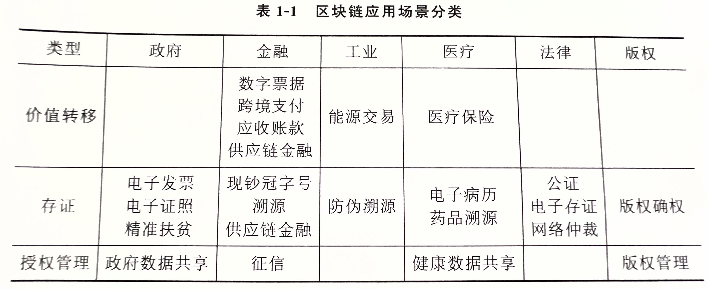

# 区块链金融

本文档主要介绍区块链在各类金融业务中的痛点和实际应用，以及创新点，内容主要节选、总结自书籍[《区块链金融》（赵华伟主编）](http://www.tup.tsinghua.edu.cn/booksCenter/book_08419801.html)

### 目录
- [区块链 + 数字货币](#区块链--数字货币)
- [区块链 + 征信](#区块链--征信)  

---

区块链之所以对金融行业有促进、创新作用，其核心之处就在于它能够用其去中心化、不可篡改特性打造一个由纯软件构成的无中介的数据生产和交换系统。如现实中的某某银行，
证券中心，保险机构，统统去掉，这个非常有利用普通用户；但这必然损害了一部分它们的利益，所以还必须在区块链系统之上构思新的审计和监管机制，这个叫创新，有利用
机构；另外除了在机构和用户之间直接去信任，还可以在机构之间去信任，让它们实现可信数据共享，这也有利于机构业务进行和单位监管。

## 应用场景汇总
根据实现方式和作用目的不同，当前基于区块链技术的应用可以划分为三类场景：
- 价值转移类：即实现数字资产在不同账户之间的转移，如跨境支付、数字货币
- 存证类：即将记录信息上链存储，作为存证/凭据，没有资产转移，如电子合同、发票
- 授权管理类：即利用智能合约控制数据访问，如数据共享

具体应用场景如下图：

## 区块链 + 数字货币
数字货币以2008年横空出世的比特币为典型代表。代表的是一种通过p2p技术实现的电子现金系统，能够做到无需银行等中介机构就能实现点对点交易。  
数字货币以数学理论为基础，运用密码学原理来实现货币的各项特性。用到的加密算法有 对称加密算法、非对称加密算法以及单向哈希函数等；常用技术有
数字签名、零知识证明和盲签名技术等。  

### 1. 货币种类
**法定货币**  
日常生活中使用的由央行背书信用的货币（如纸币、硬币）为法币，具有法律效力。

**电子货币**  
支付方式的日益迭代，已经演进到从纸币到银行卡、储值卡、支付宝/微信以及各类电子钱包等方式的各类支付手段，这些支付方式都基于电子货币账户进行资金流转。
它本质上还是用户在银行账户资金的一个网络映射，不具备独立发行机制。

**虚拟货币**  
上世界80年代，随着网络社区的兴起，市场上出现用于社区内各种虚拟商品交易的虚拟货币，如网络积分、游戏币、社交网站发行的各类代币（如Q币）。它是由某个
私有企业发行，不具备法律效力。根据国家现行规定，公众用法币购买的网络虚拟货币只能在特定平台流通，不可跨平台使用，不可用于兑换人民币（不可赎回）。  
自2008年比特币出现以来，一般提到虚拟货币通常特指比特币、以太币为首的去中心化加密货币。截至2020年4月底，市场上公有3100多种由私人部门发行的数字货币。
**由于它们缺乏内在价值，许多国际组织和政府部门称其为虚拟货币**。

**数字货币**  
指密码货币或加密货币，根据发行者不同还分为**私人数字货币和法定数字货币**。以比特币和以太币为代表的数字货币称为私人数字货币，它们的信用未经政府担保，仅体现
一种投资属性。由各国央行发行的数字货币才能称为法定数字货币，中国央行已经在2020年发布基于区块链的数字货币DCEP，其他部分国家也有发行数字货币，请自行检索。  
由数字货币引出的另一新型货币名称为网络虚拟代币，其相当于一种筹码或股权，火热一时的ICO（数字货币首次公开众筹）便是通过发行私有代币募集资金，代币价值
和融资项目发展挂钩，代币形式或称呼随项目不同而不同。
>**概念分歧**：中国部分权威机构认为，只有央行发行的数字货币具有法定地址，国家主权背书，发行责任主体明确，才是真正的数字货币，而以比特币、以太币为代表的
> 虚拟货币没有国别、没有主权背书、没有合格发行主体，亦没有国家信用支撑，不能叫做数字货币。

通用的数字货币定义：一种数字化的货币，是价值的数据表现形式，以互联网为基础，以计算机和通信技术为手段，以数字化形式存储在网络或有关电子设备中，并
通过网络系统（包括智能卡）以数据传输方式实现流通和支付功能的网络一般等价物，具有货币最基本的交易、流通职能。

**私人数字货币和法定数字货币的不同**  
- 信用背书上：私人数字货币无信用背书，法定数字货币则由国家信用背书
- 使用范围上：法定数字货币天然具有法偿地位，在具备流通环境下任何人任何机构不得拒收，私人数字货币不具有法偿性
- 价值尺度上：国家信用保证了法定数字货币计价稳定性；私人数字货币货币价值不稳，公信力不强
- 发行动机上：私人数字货币追求社会接受度最大化或利润最大化，形成垄断后可能给社会带来负面性和潜在风险和损失；法定数字货币代表国家信用及社会整体利益，能维持本经济体
范围内整体利益最大化
- 功能上：法定数字货币还承载了货币政策传导、测量、调节功能；而私人数字货币专注于私人支付媒介作用，不考虑用于调节经济的国家功能
- 架构上：法定数字货币具有中心化特征；私人数字货币采用以加密算法为核心的区块链技术，无中心化机制保障，没有运行责任兜底机构
- 私密性上：法定数字货币的使用需要第三方机构参与，这样就会留下使用记录，必要时会提供给法律机关审查；而私人数字货币是点对点交易，用户在交易过程中只需提供秘钥，无需
提供真实身份信息即可完成交易，操作完全匿名。但缺点是为网络犯罪、洗钱制造便利。
- 存储和修改上：法定数字货币仍然具有中心化特征，所以资金有被冻结风险；而私人数字货币是完全去中心化运行，任何人无法修改和删除交易记录，亦无法冻结用户资产，完全公平。

### 2.发行法定数字货币面临的挑战
#### 1.安全性
自比特币问世以来，其受到黑客攻击导致的被盗事件时有发生，因此基于区块链技术的数字货币在技术面上尚未成熟。虽然实际系统中攻击一次需要的成本投入远超过
成功攻击后的收益，但威胁仍然存在。
#### 2.应用范围
央行发行法定数字货币，第二个问题是应用范围。目前讨论的数字货币，主要指替代现金支持自然人之间的小额交易。但现在的支付宝微信已经支持了。关键是企业法人
和金融市场这两个更大的应用层面是否也需要接入？这些机构与自然人账户发生往来时，应该接受还是拒绝数字货币呢？  
答案是否定的。因为在现有的支付清算系统中，企业法人和金融市场参与者都是受到严格管制的，其账户实行严格实名制管理。后台可以看到数据全貌，目的是实现全社会的
数字化管理，包括但不限于应对税收、反洗钱、应急处理等各种挑战。  
显然，完全匿名的p2p交易的数字货币在这个时候是一个弊端，会让系统乱套。
#### 3.隐私保护
区块链中，参与者都拥有一份完整数据备份，所有交易信息都会全网公开，这是区块链在解决信息不对称领域所具有的优势。但这一点对于区块链使用方是不利的，用户
不愿公开自己的账户隐私，商业机构也不愿将商业机密公开共享给同行。如何实现隐私保护是一个难题。

### 3.基于区块链的数字货币发展潜在的问题与阻碍
#### 1.区块链技术本身架构引发的问题
- 分布式账本和共识机制的缺点是账本数据量庞大，区块同步耗时长、系统吞吐率低，无法满足法定数字货币的日常交易场景需求。
- 交易记录的公开和私钥存储都关系到用户的隐私和安全问题，人们对特定访问权限、责任确认、个人权益保护等方面的需求和区块链本身的特性存在一定冲突。

#### 2.数字货币作为货币本身发展遇到的阻碍
- 监管确认导致数字货币无法持续健康发展。已发行的加密货币市值波动剧烈就是典型后果，而且完全匿名的特性让数字货币一度成为偷税漏税、洗钱的手段，
迫使各国开始关注数字货币监管机制，部分国家明令禁止比特币交易。
- 政策调控风险。法定数字货币的发行依然需要背靠国家信用，传统货币政策调控政策是否依然适用需要进一步论证，货币的产出效应和价格效应都需要重新评估，目前相关
研究尚寥寥无几。
- 法定数字货币发行的市场风险暂无法准确地实施评估，与传统信用创造机制不同，其信用创造能力的评估和运用模式尚未完成，需要基于数字货币框架进行分析。
- 。。。

从目前发展看，已有数据货币均以区块链技术为基础，而法定数字货币却不一定采取区块链技术架构，需要去其糟粕，取其精华。考虑到变革的重要性和复杂性，要解决
遇到的一系列挑战和困难。

## 区块链 + 征信
### 征信行业现状
1. 数据孤岛问题：现有征信体系主要以央行征信为主，各征信机构（互联网公司、信贷机构、法院、政府部门、电信运营商）之间缺乏有效合作，无法实现高质量的征信数据流通及交易；
数据孤岛将引发各类问题：一方面促使企业在采集用户数据的渠道/方式上「各显神通」，引发激烈的数据源竞争，同时造成不好的用户体验；另一方面造成用户征信数据的
不可移植性，如用户在A机构的信用评级无法应用于B机构，造成用户困扰。在跨国际借贷场景中此问题更为突出。
2. 数据丢失、泄露和篡改问题：目前的用户数据都是存储在企业管理的服务器中，无法避免这个问题。 

### 构建区块链征信联盟共享平台
这是个全新的由央行征信部门牵头的区块链征信生态平台，平台中，所有的信息主体、信息需求方/提供方、监管方都成为节点，但各自权限不同。首先，掌握征信数据的各征信机构是主要
参与节点，它们既是数据需求方又是提供方。且每个机构仍然拥有自己独立的本地数据库，在充分授权情况下，机构之间可实现数据的交易和共享。  
这是一个信用联盟链，它链接各征信机构的数据库，完成第一轮的信息共享，并建立中心数据云，第一批加入联盟的机构视为联盟链会员共享中心的数据资源。然后
其他机构再不断加入其中，最终形成完善的、覆盖全国的征信体系。  

### 案例——LinkEye打造的失信人黑名单共享平台
该公司设计了黑名单（掩码+签名）运行机制、成员入驻、成员信用、仲裁、信息共享、智能定价、数据安全防火墙、开放全网查询接口八大机制。
各成员仅需将黑名单脱敏信息上链，**明细仍然保留在原平台**。链上只记录个体信息摘要（保证数据未篡改），当任一成员需要查询时，支付平台代币后即可立即点对点
查询数据明细。这样做保证了数据源平台的管理权，又打破了数据孤岛。其核心机制就是基于链上脱敏数据的方式共享黑名单，任何机构/个人都可以在支付代币后通过共享平台查询信息。
>**笔者评价**：原始数据不上链，就仍然存在丢失和信用共享风险。数据源提供方理论上可以随时关闭接口，不再提供共享。现实情况下，是依靠监管部门才能保证平台的正常运行，具有
> 一定缺陷。此模式仍需要继续探索。  
> **笔者思考**：能否可以建立一个非机构绑定的中心化数据源存储平台，要求各数据源提供方一开始就上传完整原始数据（可能几百G或上T）通过该方私钥加密后的
> 数据包存储到这个中心化数据源存储平台，然后由共享平台实现对应的基于公钥解密的数据查询接口；如此一来，当完整数据源上传后，后续的数据共享行为就可以脱离
> 提供方的掌控，只要查询方在平台上支付代币给提供方之后，通过智能合约的强制性，自动获得数据解密秘钥，然后直接在平台提供的接口查询数据即可。  
> 这个方案的问题在于存储平台的构建和维护需要资金投入，商业公司如何制定合理商业模式是一个需要考虑的问题。

